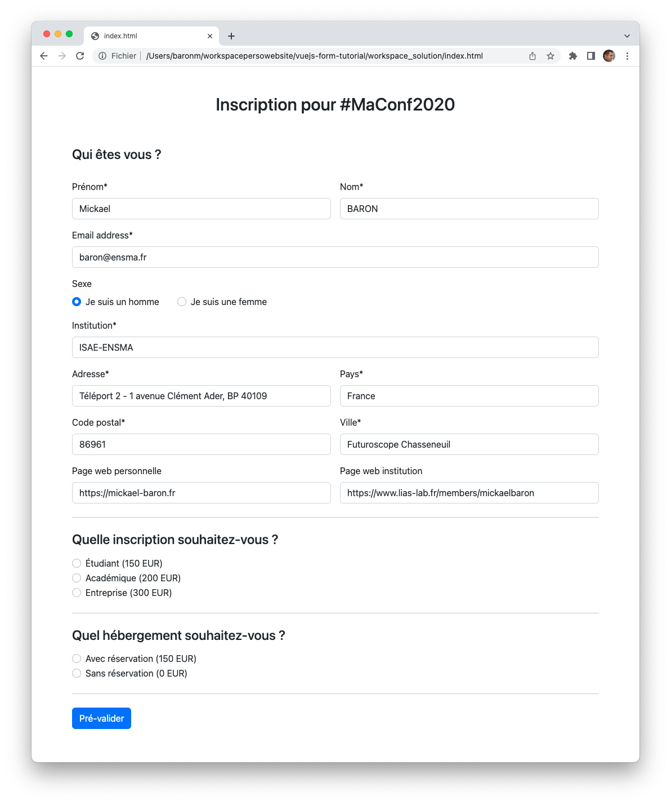
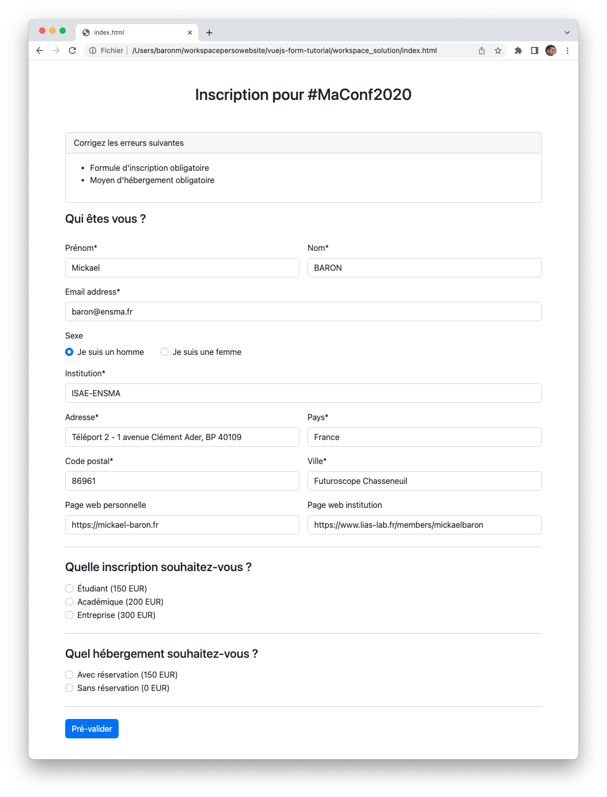
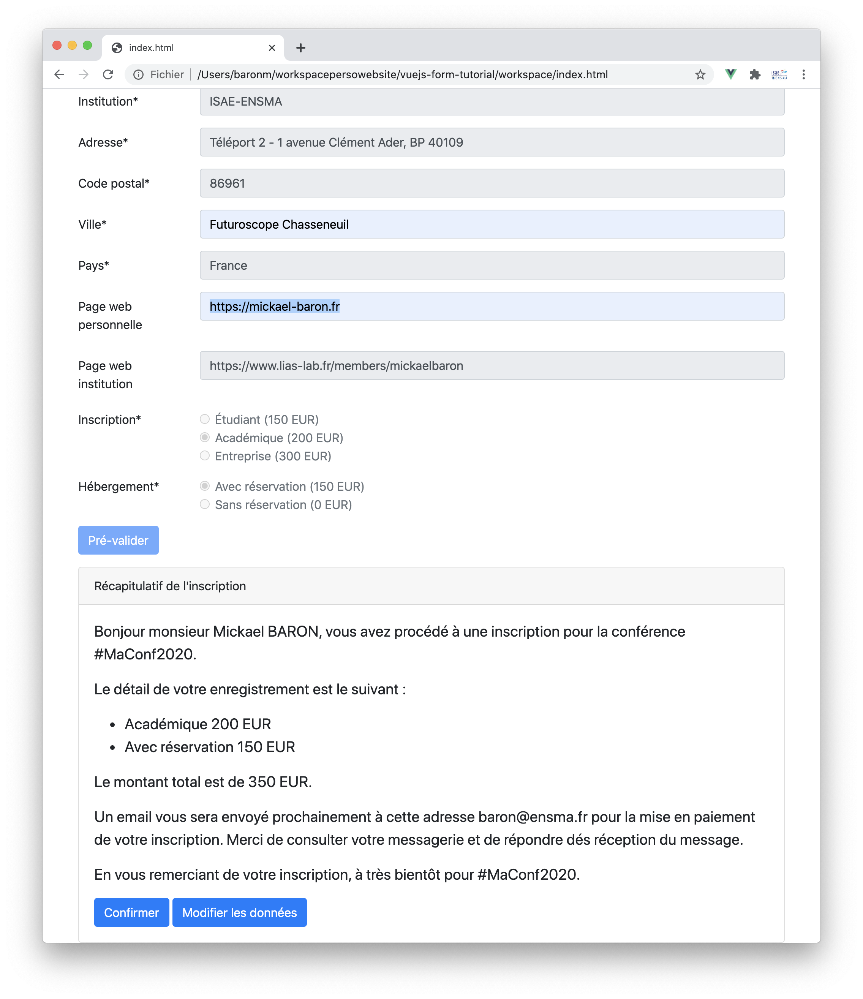

# Tutoriel Vue.js : intégration de la biliothèque dans un site web existant

L'objectif de cette série d'exercices est d'apprendre à utiliser [Vue.js](https://vuejs.org/) comme une bibliothèque dans un site web existant. Nous allons nous focaliser principalement sur la manipulation des directives proposées par [Vue.js](https://vuejs.org/).

Une grande partie du code HTML et JavaScript vous sera donnée comme support dans le répertoire _workspace_. 

**Buts pédagogiques** : référencer la bibliothèque [Vue.js](https://vuejs.org/), interpolation de texte, écriture moustache `{{ }}`, directives `v-text`, `v-model`, `v-once`, `v-for`, `v-bind`, `v-on`, `v-show` et `v-if`, manipulation de propriétés et utilisation de l'outil **Vue-DevTools** pour analyser l'état de ces propriétés.

> Ce dépôt est utilisé dans le cadre d'un cours sur le développement d'applications web que je dispense  en français à l'[ISAE-ENSMA](https://www.ensma.fr) pour les étudiants en dernière année du cycle d'ingénieur qui suivent l'option informatique. Tous les supports de cours et tutoriaux sont disponibles sur ma page Developpez.com : [https://mbaron.developpez.com](https://mbaron.developpez.com/#page_web) et sur ma page personnelle : [https://mickael-baron.fr/](https://mickael-baron.fr/).

## Prérequis logiciels

Avant de démarrer cette série d'exercices, veuillez préparer votre environnement de développement en installant les outils suivants :

* Éditeur de code [Visual Studio Code](https://code.visualstudio.com/) ;
* Navigateur web [Firefox](https://www.mozilla.org/firefox/) ou [Chrome](https://www.google.com/chrome/browser/desktop/index.html).

Il est possible d'utiliser d'autres navigateurs web, sauf que vous ne pourrez pas utiliser l'extension **Vue-DevTools** comme module intégré.

## Présentation de l'étude de cas

L'étude de cas utilisée dans cette série d'exercices est un formulaire d'inscription pour une conférence scientifique. Ce formulaire est disponible comme une page web intégrée au site web de la conférence scientifique. Seule, la page web du formulaire d'inscription est développée avec la bibliothèque [Vue.js](https://vuejs.org/), car c'est la seule page web qui contient un comportement dynamique. L'image ci-dessous montre l'apparence du formulaire.

Le formulaire contient un ensemble de zones de saisie libres pour renseigner l'email, le nom, le prénom... et des boutons à sélectionner (*radiobutton*) pour le choix du type d'inscription et du mode d'hébergement. De nombreuses informations sont obligatoires et identifiées par une `*` au niveau des titres des zones de saisie. Le bouton **Pré-valider** permet de valider le contenu saisi. Si des informations sont manquantes, une zone d'erreur est affichée sur la partie haute du formulaire comme montrée sur la figure ci-dessous.

L'affichage des erreurs est constitué d'une liste d'éléments pour chaque information obligatoire manquante. Un contrôle plus stricte est réalisé en plus sur l'email pour s'assurer qu'elle est renseignée et qu'elle est valide syntaxiquement. Si toutes les informations sont valides, un récapitulatif de l'inscription est affiché dans une zone située après le bouton  **Pré-valider** comme montré sur la figure ci-dessous.

Le récapitulatif de l'inscription permet de résumer les données saisies et de calculer le montant total que le participant devra régler. Ce montant total est calculé sur la base du type d'inscription et si le participant souhaite que la conférence scientifique prenne en charge son hébergement. Lors de l'affichage de ce récapitulatif les zones de saisie sont désactivées. Le participant doit cliquer sur le bouton **Modifier les données** pour éditer ses informations qui seront re-activées (retour à l'état précédent). Pour confirmer son inscription, le participant doit cliquer sur le bouton **Confirmer**. Les informations sont alors envoyées sur un serveur pour traitement. Cet envoi ne sera pas traitée par cette série d'exercices.

## Ressources

Retrouver les autres tutoriels :

* [Article sur les généralités des frameworks web JavaScript et sur la présentation de Vue.js](https://mickael-baron.fr/web/vuejs-generalites-part1) ;
* [Article sur la mise en œuvre des concepts de Vue.js](https://mickael-baron.fr/web/vuejs-miseenoeuvre-part2) ;
* [Article sur le déploiement d'une application web développée avec Vue.js](https://mickael-baron.fr/web/vuejs-deploiement-part3).

Pour aller plus loin, vous pouvez consulter les ressources suivantes :

* TODO (supports de cours)