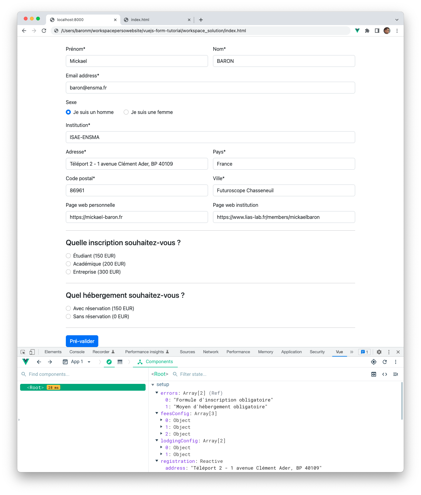

# Exercice 3 : réaliser des rendus de liste et réagir aux interactions

Ce troisième exercice s'intéresse à montrer comment réaliser un rendu de liste à partir de la directive `v-for`, comment lier un attribut d'une balise à une expression et comment gérer l'écoute des événements à partir de la directive `v-on`.

## But

* Utiliser la directive `v-for`.
* Utiliser la directive `v-on` et sa version simplifiée `@`.
* Utiliser la directive `v-bind` et sa version simplifiée `:`.

## Étapes à suivre

* Éditer le fichier _index.js_ pour ajouter des nouvelles propriétés. Ces propriétés permettront de stocker les valeurs d'initialisation pour les différents types d'inscription et modes d'hébergement.

```JavaScript
const { createApp, ref, reactive } = Vue

createApp({
    setup() {
        const title = ref('#MaConf2020')
        const feesConfig = [
            { price: 150, text: 'Étudiant', value: 'student' },
            { price: 200, text: 'Académique', value: 'academic' },
            { price: 300, text: 'Entreprise', value: 'industrial' },
        ]
        const lodgingConfig = [
            { price: 150, text: 'Avec réservation', value: 'with', lodgingAvailable: true },
            { price: 0, text: 'Sans réservation', value: 'without', lodgingAvailable: true }
        ]
        const registration = reactive(...)

        return { title, registration, feesConfig, lodgingConfig }
    }
}).mount('#app');
```

`feesConfig` est un tableau d'objet pour initialiser les différents types d'inscription. Ce tableau contient trois éléments d'un objet contenant trois propriétés : `price` pour le prix d'un type d'inscription, `text` pour le texte à afficher à l'utilisateur et `value` pour la valeur à retourner au serveur. `lodgingConfig` est un tableau d'objet pour initialiser les modes d'hébergement. Ce tableau contient deux éléments d'un objet contenant quatre propriétés : `price` pour le prix avec ou sans hébergement, `text` pour le texte à afficher à l'utilisateur, `value` pour la valeur à retourner au serveur et `lodgingAvailable` pour savoir s'il reste des places disponibles. Veuillez noter que ces propriétés ne sont pas réactives (n'utilisent pas `ref` ou `reactive`) puisque leur contenu ne sera pas modifié.

Par l'intermédiaire de la directive `v-for` nous allons pouvoir afficher le contenu de ces deux tableaux. La directive `v-for` permet de réaliser plusieurs fois le rendu d’un élément (où s’applique la directive). La valeur de la directive `v-for` doit suivre la syntaxe `alias in expression` ou `expression` peut-être issue d’une donnée source de type **tableau** ou d’**objet** (via les propriétés de l’objet). `alias` permettra d’accéder à l’élément courant. 

Nous présentons ci-dessous les différentes syntaxes que vous pourrez retrouver en utilisant `v-for` en fonction du type de source (**tableau** ou **objet**).

```html
<!-- La source items est un tableau. items: [ { text: 'text1' }, { text: 'text2'} ] -->
<div v-for="item in items">{{ item.text }}</div> --> item est l'élément courant (ex : text1)
<div v-for="(item, index) in items"></div> --> item est l'élément courant (ex : text1) et index l'indice de l'élément (ex : 0)

<!-- La source object est un objet. object: { prenom: 'mickael', familyname: 'baron' } -->
<div v-for="val in object"></div> --> val est la valeur de la propriété (ex : mickael)
<div v-for="(val, key) in object"></div> --> val est la valeur de la propriété (ex : mickael) et key le nom de la propriété (ex : prenom)
<div v-for="(val, key, index) in object"></div> --> val est la valeur de la propriété (ex : mickael), key le nom de la propriété (ex : prenom) et index l'indice de la propriété (ex : 0)
```

* Éditer le fichier _index.html_ au niveau de l'information `<!-- Fees -->` en utilisant la directive `v-for` et sa syntaxte simplifiée `:` pour effectuer un rendu de liste sur les différents type d'inscription. La source dans ce cas est un tableau.

```html
<!-- Fees -->
<h4 class="mb-3">Quelle inscription souhaitez-vous ?</h4>
<div class="form-check" v-for="val in feesConfig">
    <input class="form-check-input" type="radio" name="feesRadios"
        v-bind:id="'feesradios'+val.value" v-bind:value="val.value" v-model="registration.fees">
    <label class="form-check-label" :for="'feesradios'+val.value">
        {{ val.text }} ({{ val.price }} EUR)
    </label>
</div>
```

Une itération est réalisée sur l'ensemble des éléments du tableau de `feesConfig`. Seule la valeur `val` est intéressante dans notre cas. L'index n'est pas utilisé. Une liaison bidirectionnelle est réalisée entre la propriété `registration.fees` et le bouton à sélectionner (`radiobutton`) en utilisant la directive `v-model` (voir exercice 1). Pour modifier les valeurs des attributs `id` et `value` de la balise `<input>` ainsi que l'attribut `for` de la balise `<label>`, la directive `v-bind` est utilisée. Cette directive permet de lier un attribut d’une balise à une expression.

* Sur le même principe que précédemment, éditer le fichier _index.html_ au niveau de l'information `<!-- Lodging -->` en utilisant la directive `v-for` pour effectuer un rendu de liste sur les différents modes d'hébergement.

Pour l'instant, notre formulaire d'inscription ne réagit pas aux différentes interactions. Si vous cliquez actuellement sur le bouton **Pré-valider** un rafraichissement de la page se produira car le bouton est de type `submit` est associé au formulaire. Le comportement attendu est le suivant : s'il y a des informations manquantes ou erronées la zone d'erreurs doit lister les erreurs, sinon la zone de récapitulatif de l'inscription doit s'afficher.

La directive `v-on` permet d'attacher un écouteur d'événements à un élément et de faire appel à une méthode dès lors qu'un événement est émis. Le type d'événement est donné comme argument séparé par un deux-points après la directive `v-on`. [Vue.js](https://vuejs.org/) fournit également une écriture simplifiée de la directive `v-on`. Comme cette directive est largement utilisée, elle peut être remplacé par `@`.

* Éditer le fichier _index.html_ au niveau de la balise `<form>` en ajoutant l'abonnement à l'événement `submit` qui permettra d'invoquer la méthode `checkForm`.

```html
<body>
    <script src="https://unpkg.com/vue@3"></script>

    <div id="app" class="container" style="max-width: 960px;">
        <main>
            <div style="text-align: center !important;" class="py-5">
                <h2 v-once>Inscription pour {{ title }}</h2>
            </div>

            <form @submit.prevent="checkForm" method="post">
```

> le passage de paramètre à la méthode `checkForm` est implicite. Sous cette forme, l'objet événement (`event`) qui contient les informations de l'interaction sera passé automatiquement. 

> le modificateur d'événements `prevent` permet de stopper le rechargement de la page.

* Éditer le fichier _index.js_ pour ajouter les méthodes `checkForm` et `validEmail` puis les propriétés `errors` et `validated`.

```JavaScript
const { createApp, ref, reactive } = Vue

createApp({
    setup() {
        ...
        const errors = ref([])
        const validated = ref(false)

        function checkForm() {
            errors.value = []

            if (!registration.email) {
                errors.value.push('Email obligatoire');
            } else if (!validEmail(registration.email)) {
                errors.value.push('Email non valide');
            }

            if (!registration.firstName) {
                errors.value.push('Prénom obligatoire');
            }

            if (!registration.sexe) {
                errors.value.push('Sexe manquant');
            }

            if (!registration.familyName) {
                errors.value.push('Nom de famille obligatoire');
            }

            if (!registration.institution) {
                errors.value.push('Nom de l\'institution obligatoire');
            }

            if (!registration.address) {
                errors.value.push('Adresse obligatoire');
            }

            if (!registration.zipCode) {
                errors.value.push('Code postale obligatoire');
            }

            if (!registration.city) {
                errors.value.push('Ville obligatoire');
            }

            if (!registration.country) {
                errors.value.push('Pays obligatoire');
            }

            if (!registration.fees) {
                errors.value.push('Formule d\'inscription obligatoire');
            }

            if (!registration.lodging) {
                errors.value.push('Moyen d\'hébergement obligatoire');
            }

            if (!errors.value.length) {
                validated.value = true
            } else {
                validated.value = false
            }
        }

        function validEmail(pEmail) {
            let re = /^(([^<>()[\]\\.,;:\s@"]+(\.[^<>()[\]\\.,;:\s@"]+)*)|(".+"))@((\[[0-9]{1,3}\.[0-9]{1,3}\.[0-9]{1,3}\.[0-9]{1,3}\])|(([a-zA-Z\-0-9]+\.)+[a-zA-Z]{2,}))$/;
            return re.test(pEmail);
        }

        return { title, registration, feesConfig, lodgingConfig, checkForm, errors, validated }
    }
}).mount('#app');
```

* Afin de vous assurer que le tableau `errors` est modifié si des informations sont manquantes, nous allons ré-utiliser l'outil **Vue-DevTools** (voir exercice 2) pour examiner le contenu de la propriété `errors`. Ne pas renseigner d'information pour les champs type d'inscription et mode d'hébergement et cliquer sur la bouton **Pré-valider**. La propriété devrait se mettre à jour et contenir deux éléments comme précisé sur la figure ci-dessous.



## Avez-vous bien compris, valider vos compétences ? 

Pour valider vos compétences sur les directives étudiées dans cet exercice (`v-for`, `v-on` et `v-bind`), des développements restent encore à réaliser.

* Effectuer un rendu de liste pour l'affichage des erreurs situé au niveau de la balise `<b>Corrigez les erreurs suivantes : </b>`.

* Réaliser la gestion des écouteurs pour les boutons **Modifier** et **Confirmer**. Lors de l'action à **Modifier**, vous changerez l'état de la propriété `validated` à `false`. Enfin, lors de l'action à **Confirmer**, vous pourrez afficher le contenu des données du formulaire en appelant la function `confirm()` dont le code est donné ci-dessous.

```JavaScript
function confirm() {
    let resultObject = {
        email: registration.email, firstname: registration.firstName, familyname: registration.familyName,
        sexe: registration.sexe, institution: registration.institution, address: registration.address,
        zipcode: registration.zipCode, city: registration.city, country: registration.country, webpage: registration.webpage,
        institutionwebpage: registration.institutionwebpage, fees: registration.fees, lodging: registration.lodging
    }

    console.log(resultObject);
}
```

* Lier l'attribut `disabled` au niveau de la balise englobante `<fieldset>` à la propriété `disabled` en utilisant la directive `v-bind`. Lorsque cet attribut sera à `disabled`, tous les composants contrôles enfants seront désactivés.

